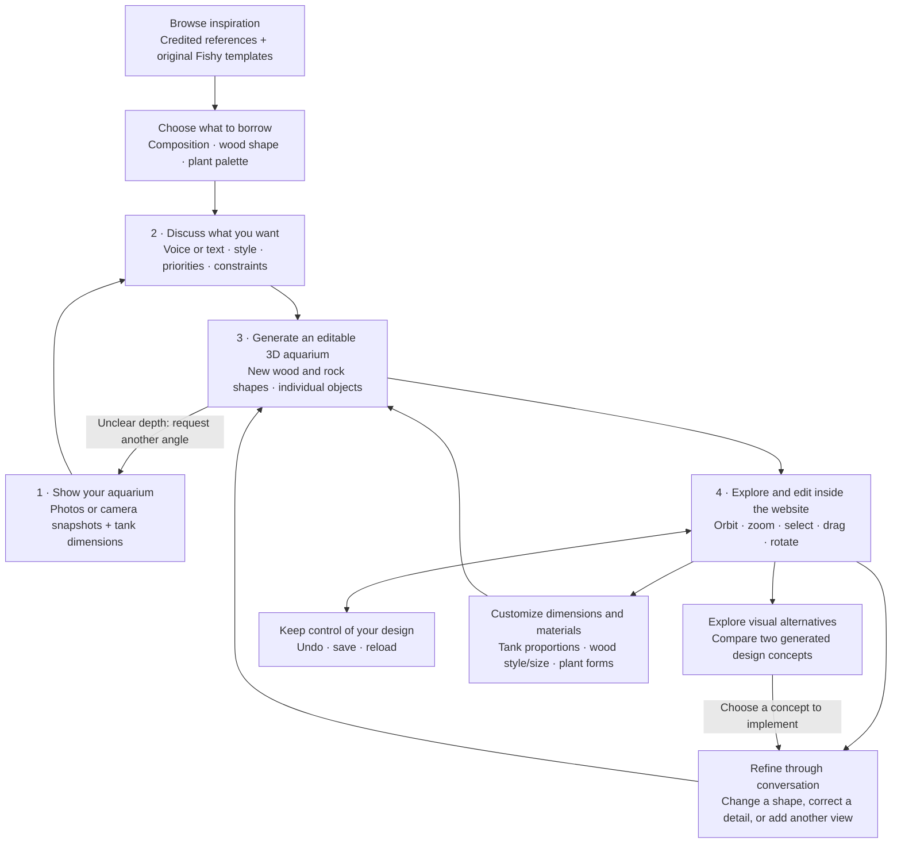
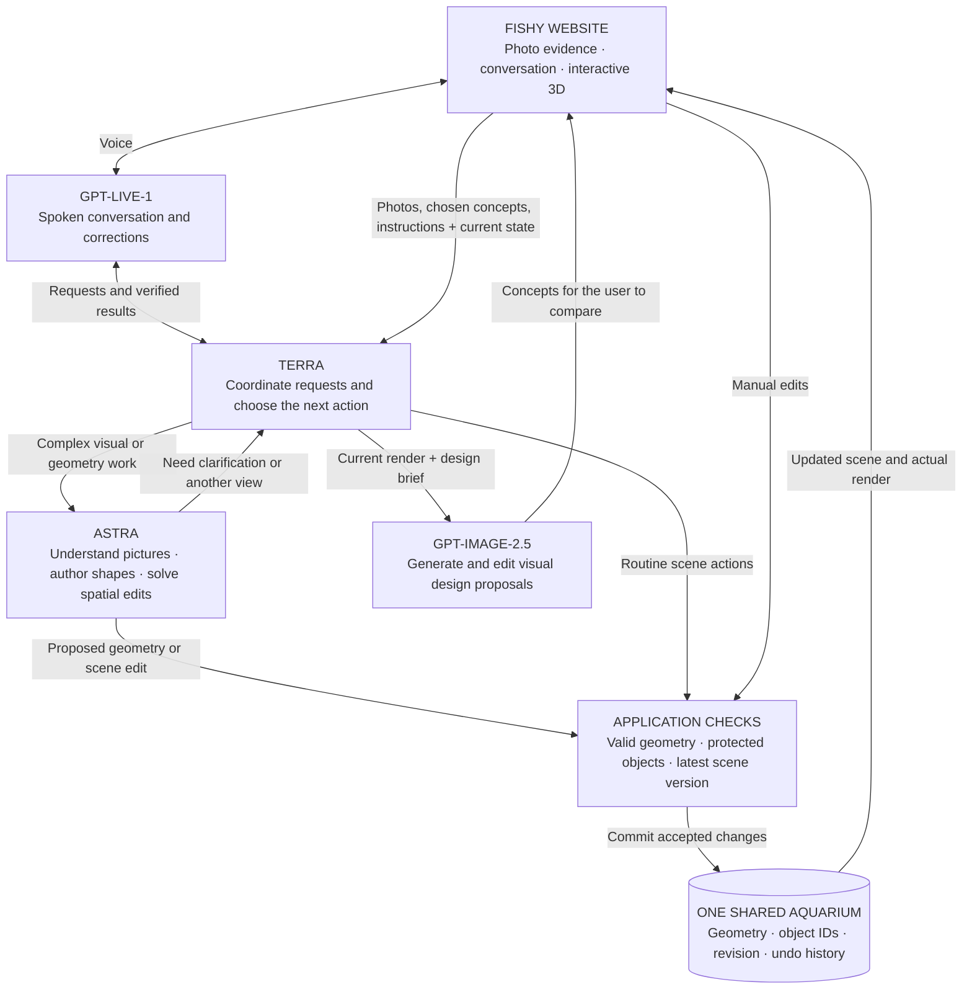

# Fishy product design

Target experience, 13 September 2026. This describes the product being built, not a claim that every integration is already live. The deployed ChatGPT Site is the interactive editor. Terra coordinates work; Astra handles complex visual understanding and geometry. See WEB_FRONTIER_RISK_REVIEW.md for the detailed acceptance plan.

**Core consideration: design quality.** Every generation, proposal, edit, and explanation is judged against the eight aquascape design principles in [DESIGN_PRINCIPLES.md](DESIGN_PRINCIPLES.md): hardscape first, one sightline, contrast, mood, proportion, negative space, story, and maintenance. Every recipe carries a `design` block declaring composition, focal object, sightline, mood, maintenance tier, and story. Trusted code reviews the geometry against those principles (`blender/design_review.py`, mirrored for the browser in `site/lib/design.ts`) and the conversation layer explains results in those terms. Reconstruction, editing, voice, and image proposals exist to reach a well-designed tank, not the other way round.

## The user journey

The image proposals are design choices. The 3D model is the object the user actually edits. Asking for another photograph can improve the geometry; it does not create evidence of hidden surfaces that were never photographed.

## What happens behind the experience

Checks belong to trusted application code. A model can propose a change, but a stale response cannot overwrite a newer drag or correction. Voice completion messages follow the actual application result. Live's voice layer receives backend findings; aquarium images are routed to Astra.

Blender remains available for complex asset authoring, research and export. The visitor uses the website and does not need Blender installed or running.

## Functional scope

| Area | Planned capability | Observable result |
| --- | --- | --- |
| Capture | Upload a photo or screenshot; supply a selected camera frame; enter tank dimensions. | Evidence is associated with the current project and labeled as measured or assumed where applicable. |
| Inspiration | Browse credited references and original templates; save a reference and choose the features to borrow. | A design brief linked to its sources. Incomplete scrape records and unlicensed images do not become published gallery assets. |
| Tank configuration | Change width, depth and height; compare classic, panoramic and cube proportions. | The container changes without silently stretching every piece of wood or plant. Objects that no longer fit are identified. |
| Material catalog | Browse 10 wood trade types/styles and 10 plant taxa/cultivars; choose visual forms and scale. | Sourced material references remain distinct from procedural meshes and actual retailer stock. |
| Water appearance | Preview a restrained moving surface and caustic light patterns with a quality control. | Convincing water optics while editing remains responsive; no claim of fluid or biological simulation. |
| Design review | Every generated recipe and every manual edit is checked against the eight design principles; warnings, notes, and passes are shown by principle. | A user sees why a layout reads weak (no sightline, underweight hardscape, cluttered floor) and what to change, without a numeric score or biological claim. |
| Conversation | Type or speak; answer clarification; correct or cancel a request. | The next action reflects the latest instruction, and explanations name the design principle at stake. |
| Reconstruction | Astra generates new bounded branch/rock shapes and object placements. | Inspectable meshes, not only a generated image or prearranged scene. |
| Refinement | Compare real references with scene renders; request another angle. | The actual model changes in response to new evidence. |
| Manual editing | Orbit, zoom, highlight, move and rotate objects. | Direct interaction without waiting for a model call. |
| Visual exploration | Generate constrained design concepts; select one. | A chosen visual difference is translated into an editable scene change. |
| State and recovery | Protect objects; detect stale edits; cancel; undo; save and reload. | Manual work and accepted model edits stay consistent. |

## Example interaction

1. Upload the tank photo: “Rebuild this aquarium. It is 60 cm wide.”
2. Inspect the first 3D result: “That branch passes behind the rock.”
3. Supply an oblique photo when asked. Astra revises the branch shape or depth.
4. Ask for two planting-layout concepts and choose one.
5. Say, “Keep the arch and move the smaller rock forward.”
6. Correct: “Actually, leave the rock.” The pending operation is superseded, or an applied operation is undone.
7. Drag a plant manually and save. The next AI request receives that updated state.

All examples are target behavior to test. The current evidence does not establish metric reconstruction accuracy or biological validity.

## Three hackathon entries, one product

| Track | Visible proof |
| --- | --- |
| Visual Understanding | An unfamiliar real image produces new editable geometry; additional visual evidence improves or corrects it. |
| GPT-Live-1 | Conversation continues during work, and a spoken correction affects the actual scene. |
| GPT-Image-2.5 | Generated proposals help the user choose a design, and the chosen difference is implemented in 3D. |

Inspiration and configurable tank/material design are now core requirements following the user's updated direction. Species compatibility checks, growth simulation, shopping and local sourcing remain later layers. See `design-lab/PRODUCT_DIRECTION.md` for the updated workflow and implementation boundaries. No contest entry has been submitted by creating this document.
