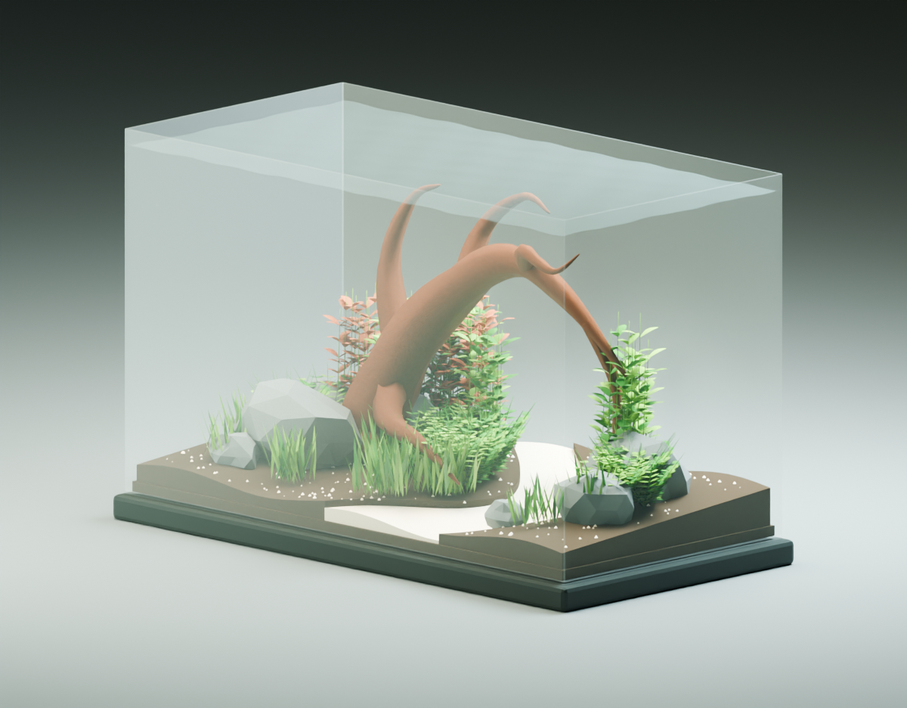
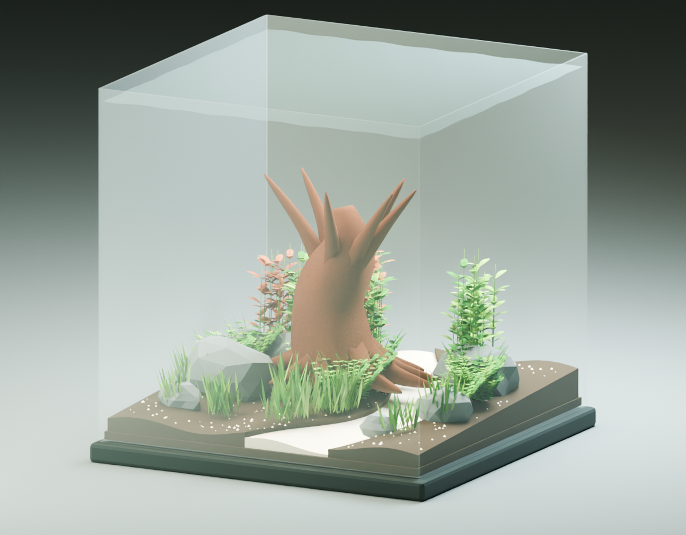

# Fishy

> **A visual-understanding studio for turning aquarium references into editable, bounded 3D aquascapes.**

Fishy helps an aquascaper move from a real aquarium photograph, a material reference, or a design brief to a composition they can inspect, edit, export, and rebuild in Blender. It is not an image filter and it does not pretend a single photo is a perfect 3D scan. Instead, Fishy makes visual interpretation explicit: a model proposes a constrained scene; deterministic geometry verifies it; and a human keeps control of the final layout.



## Why Fishy

Aquascaping is fundamentally spatial. A reference image encodes hierarchy, negative space, depth, silhouette, massing, and the relationship between plants and hardscape—but it rarely exposes exact dimensions or the occluded sides of an object. Conventional inspiration boards can show a beautiful tank; they cannot turn the visual idea into an editable plan while preserving uncertainty.

Fishy closes that gap with a **photo → structured scene → editable 3D → render-and-revise** loop:

```text
Real aquarium / object photo
          │
          ▼
Visual interpretation constrained to a small material vocabulary
          │  (composition, placement, scale, yaw, uncertainty)
          ▼
Validated Fishy scene / fishy.recipe.v2
          │
          ├──► Interactive Three.js aquarium editor
          │
          └──► Trusted Blender builder → native .blend → renders
                                                     │
                                                     └──► Astra revision input
```

The result is a useful creative artifact—not a flat image that merely looks plausible. Every object has an identity, an envelope, a placement, a reproducible seed, and a route back to a native Blender scene.

## Best example of visual understanding

Fishy’s strongest demonstration is its **Astra photo-to-scene pipeline**. It treats real images as evidence for a constrained reconstruction task, then makes every stage inspectable.

### What the system understands from an image

Given one or more aquarium references, Astra is asked to infer the large-scale visual structure:

- the dominant hardscape silhouette and its directional flow;
- foreground, midground, and background massing;
- open water / negative-space channels and the focal structure;
- approximate plant-group volumes rather than invented species-level detail;
- uncertain depth, occlusion, scale, and limitations of the available procedural assets.

It does **not** claim to recover hidden geometry, biological compatibility, exact material identity, or photorealism from a single picture. That distinction is deliberate: Fishy turns a visual hypothesis into an editable, testable scene while preserving what remains unknown.

### The mechanisms that make cross-creation possible

| Stage | What happens | Why it matters |
| --- | --- | --- |
| **Reference intake** | Browser generation accepts up to four client-compressed JPEG, PNG, or WebP images; the native runner validates file type and a 20 MiB cap. | Keeps the visual input bounded and reproducible. |
| **Constrained visual reasoning** | Astra receives the reference image(s), fixed tank dimensions, coordinate rules, design principles, and a strict JSON schema. | The model returns a scene description—not arbitrary code or an unbounded 3D file. |
| **Grounded material vocabulary** | The browser agent can choose only from supported catalog components; the Blender path uses four procedural families: `rock`, `branchwood`, `grass`, and `bush`. | Every inferred item has a known way to become editable geometry. |
| **Geometry materialization** | Normalized model placements become local components. Fishy fits them to the tank, separates overlapping bases, preserves human-protected objects, and rejects out-of-bounds results. | Visual intent is converted into manipulable, safe scene state. |
| **Recipe contract** | `fishy.recipe.v2` records tank dimensions, object envelopes, yaw, seeds, design intent, assumptions, and a focal-object reference. | The interpretation survives beyond one chat or browser session. |
| **Native reconstruction** | Trusted Blender Python regenerates editable assets inside the declared envelopes, embeds the recipe, and verifies transforms, IDs, bounds, and provenance. | A model proposal becomes a real `.blend`, without executing model-written code. |
| **Visual revision** | A later Astra call receives the original reference, the prior recipe, prior renders, and a geometric design review. | The system can compare a generated view with visual evidence and produce a constrained revision. |

This is “cross-creation” in the useful sense: **a real visual reference is translated into structured 3D intent, and 3D renders return as visual evidence for the next constrained interpretation.** The browser and Blender are not trying to recreate pixels; they recreate composition, volume, spatial relationship, and editability.

### Evidence from the native Astra loop

The repository includes documented live runs in [`blender/ASTRA_RUN_RESULTS.md`](blender/ASTRA_RUN_RESULTS.md). On 13 September 2026, Fishy used `gpt-6-astra` to turn a 280 × 210 aquarium reference into a validated recipe, an editable Blender scene, and front/overview renders. A second run received the same reference plus the previous recipe and renders, then produced a revised 18-object scene. A third run verified the Blender-button workflow while the viewport remained responsive.

Those runs are meaningful evidence of an image-to-editable-scene and render-to-revision loop. They are **not** a claim of metric 3D reconstruction or aquarium husbandry validation; the evidence and limitations are retained alongside each run.

## Real references, not just generated imagery

Fishy lets users inspect real reference photography alongside its editable procedural counterpart:

- Material cards can link to credited, licensed reference photos and clearly mark them as photographic references rather than the selected specimen.
- Gallery references distinguish source metadata, a user’s session-only image, IAPLC imagery where available, and original Fishy renders.
- The editor can export one frozen scene from five views: front, left, right, top, and perspective overview. The packet includes PNGs, cameras, dimensions, scene data, and SHA-256 identities—never five unrelated “best-looking” images.



## Product capabilities

### Browser aquascape studio

- Build and sculpt a 3D aquarium in an interactive Three.js viewport.
- Browse supported organic materials, substrates, filters, and lights, with explicit source and rendering-limit notes.
- Attach reference photos and ask the composition agent to generate a bounded, editable aquascape plan.
- Protect manual object edits so a later generation preserves them.
- Undo/redo scene revisions, save projects locally, and export scene data or a Blender recipe.
- Export five fixed reference views for presentation, review, or a future native revision workflow.
- Keep design intent with the scene: composition, focal object, sightline, open foreground, mood, maintenance tier, and story.

### Native Blender studio

- Generate a Blender aquarium from a photo through the **Astra Design** panel.
- Keep Blender responsive while generation runs in a background process.
- Create a fresh editable `.blend` from a validated `fishy.recipe.v2` document.
- Preserve a full run record: input hashes, prompt, schema, raw response, recipe, design review, build log, renders, and manifest.
- Open completed designs separately and continue manual Blender editing offline.

### Designed for auditability

Fishy is intentionally conservative about generative output:

- Model responses are schema-constrained and validated before a scene is built.
- The model is never asked to write or execute Blender code; trusted local code performs construction.
- Tank dimensions are fixed for a generation. All rotated envelopes must remain inside the tank and above substrate.
- Generation inputs are registered and hashed; held-out/evaluation image bytes can be kept out of model transport.
- No silent repair, automatic retry, or fallback model is used in the documented native generation loop.

## Architecture

```text
┌────────────────────────────────────────────────────────────────┐
│ React / Vinext browser studio                                   │
│  reference photos + brief + current scene                       │
└───────────────────────────────┬────────────────────────────────┘
                                │ Responses API + Structured Outputs
                                ▼
┌────────────────────────────────────────────────────────────────┐
│ Aquascape composition agent                                     │
│  constrained catalog IDs, normalized placement, design intent   │
└───────────────────────────────┬────────────────────────────────┘
                                │ fit, separation, bounds, protection
                                ▼
┌────────────────────────────────────────────────────────────────┐
│ Validated Fishy scene                                           │
│  interactive Three.js edit • undo • five-view export            │
└───────────────────────────────┬────────────────────────────────┘
                                │ fishy.recipe.v2
                                ▼
┌────────────────────────────────────────────────────────────────┐
│ Blender builder                                                  │
│  procedural assets • native editable .blend • verification      │
└───────────────────────────────┬────────────────────────────────┘
                                │ reference + prior recipe + renders
                                ▼
                         Astra revision run
```

### Why use a recipe rather than a generated mesh?

The recipe is the boundary between visual reasoning and reliable geometry. It uses metres, fixed tank dimensions, a pre-yaw object envelope, yaw angle, and deterministic seed. Blender regenerates procedural geometry inside that envelope. This gives a composition that can be edited natively, compared across revisions, and rejected when it no longer fits.

It also means the Blender result matches **layout, footprint, scale, and intent**, not the exact browser mesh or the exact silhouette of an individual piece of driftwood. Sculpt edits currently cross over as bounds only; X/Z tilt and per-object colour are not fully transferred.

## GPT-Image-2.5: proposed Blender-to-2D editing extension

> **Important status:** GPT-Image-2.5 Blender-to-2D editing is a proposed extension for the hackathon narrative. It is **not implemented in this repository** and is not part of the evidence above. The existing, demonstrated visual loop uses Astra for photo-to-recipe and render-to-recipe revision.

The natural next capability is a controlled **Blender-to-2D edit loop**: use a Blender render as the structural source of truth, let a 2D image model make a visual art-direction pass, then bring only safe, explainable edits back to the 3D scene.

### Intended flow

```text
Editable Blender scene + camera + object-ID / depth / normal passes
                           │
                           ▼
               GPT-Image-2.5 directed image edit
           (e.g. soften planting mass, deepen background)
                           │
                           ▼
         change mask + image comparison + semantic edit request
                           │
                           ▼
     constrained Fishy recipe delta → validate → rebuild in Blender
```

In this proposed design, GPT-Image-2.5 would never replace the Blender scene or be treated as geometry. It would produce an art-directed 2D target plus a change region. Fishy would compare that target with the original render and translate only supported changes—such as moving a plant mass, changing a catalog material, adjusting an object’s envelope, or revising a camera-facing silhouette—into a recipe delta. The existing recipe validator and Blender bounds checks would remain the final authority.

That separation makes 2D editing useful without hiding the distinction between **a compelling image edit** and **a physically editable 3D aquarium**:

- Blender provides camera calibration, object identity, geometry, depth, and a reproducible base render.
- GPT-Image-2.5 would provide visual restyling and localized design intent.
- Fishy’s scene/recipe validator would decide whether a requested 3D change is in-bounds, supported, and safe to apply.
- The user would inspect and accept the candidate delta before rebuilding the `.blend`.

This is the direction in which Fishy can become a stronger bridge between creative image editing and real 3D design—while keeping the product honest about what has been generated, inferred, and verified.

## Quick start

### Browser studio

**Requirements:** Node.js 22.13 or later.

```sh
cd site
npm run install:ci
cp .env.example .env.local
# Add OPENAI_API_KEY to .env.local when using AI generation.
npm run dev
```

Open the local URL printed by the development server. The editor itself works without an API key; generation needs `OPENAI_API_KEY`. The default browser agent model is `gpt-5.5` and can be changed with the server-only `OPENAI_MODEL` environment variable.

Useful commands:

```sh
cd site
npm test
npm run lint
npm run build
```

### Build a browser design in Blender

1. In Fishy, choose **Project menu → Export Blender recipe**.
2. Build the downloaded `fishy-recipe-revision-<n>.json` with Blender:

```sh
<BLENDER_BIN> --background --factory-startup --python-exit-code 1 \
  --python blender/build_recipe.py -- \
  --recipe <PATH_TO_RECIPE.json> \
  --output <PATH_TO_OUTPUT.blend> \
  --render-dir <PATH_TO_PREVIEWS>
```

`<BLENDER_BIN>` is your local Blender executable. On the original macOS prototype it was `/Users/joshuabanzon/Applications/Blender.app/Contents/MacOS/Blender`; set it to the equivalent path on your system.

### Generate an Astra Blender design from a photo

The native runner needs Blender plus a signed-in Codex CLI with access to `gpt-6-astra` (or an OpenAI API key with the optional API backend):

```sh
python3 blender/generate_scene.py doctor
python3 blender/generate_scene.py generate \
  --image <PATH_TO_AQUARIUM.jpg> \
  --tank-cm 60 30 36 \
  --dimensions-source assumed \
  --backend codex
```

To create a render-informed revision from a previous completed run:

```sh
python3 blender/generate_scene.py generate \
  --revise-run blender/runs/<RUN_ID> \
  --backend codex
```

Each generation makes at most one model request and creates a new run directory. See [`blender/README.md`](blender/README.md) and [`blender/ASTRA_RUN_RESULTS.md`](blender/ASTRA_RUN_RESULTS.md) for the fuller operating guide, verified results, and known limits.

## Repository guide

| Path | Purpose |
| --- | --- |
| [`site/`](site/) | React/Vinext web application, composition agent, Three.js editor, exports, and tests. |
| [`site/lib/aquascape-agent.ts`](site/lib/aquascape-agent.ts) | Structured model request, catalog restriction, plan validation, scene materialization, fit, and separation. |
| [`site/lib/recipe.ts`](site/lib/recipe.ts) | Browser scene → `fishy.recipe.v2` conversion and recipe-fit validation. |
| [`blender/`](blender/) | Native Blender panel, recipe builder, generator, validation, and tests. |
| [`blender/generate_scene.py`](blender/generate_scene.py) | Bounded Astra generation runner and recorded visual-revision workflow. |
| [`blender/scene_recipe.py`](blender/scene_recipe.py) | Strict recipe schema and geometry contract. |
| [`DESIGN_PRINCIPLES.md`](DESIGN_PRINCIPLES.md) | The composition principles carried through the visual-design workflow. |

## Current limits and next steps

Fishy is a composition and visual-understanding prototype. It deliberately has a narrow asset vocabulary, supports approximate procedural geometry, and cannot prove real-world measurements or biological suitability from an image. A single reference photo also cannot reveal the occluded sides of driftwood, the depth of a rock, or the true dimensions of a tank.

The most valuable next work is to expand the editable asset vocabulary, gather multiple calibrated reference views, measure visual similarity against held-out photographs with a frozen builder, and implement the proposed GPT-Image-2.5 edit-delta workflow with explicit user review.

## Built for a visual AI hackathon

Fishy demonstrates visual understanding by making vision **operational**: it extracts composition from an image, expresses it as bounded spatial structure, turns it into an editable scene, renders it for comparison, and records what was inferred rather than disguising uncertainty. That is the difference between generating an attractive aquarium picture and building a creative tool someone can actually continue designing in.
