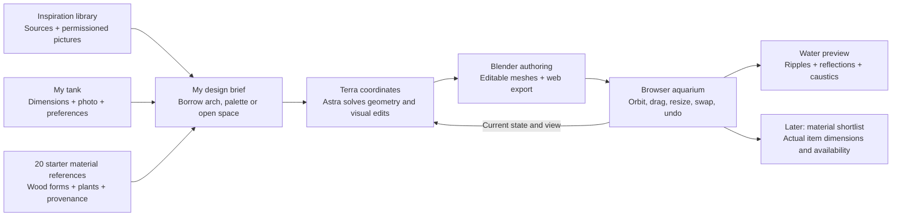

# Fishy: inspiration you can turn into your own aquarium

Updated 13 September 2026. Target product behavior is separated below from the delivered research and procedural assets.

## Product decision

Make the gallery a first-class route into the editor. Its purpose is to reduce the work between seeing an appealing tank and making a feasible personal design. The important bridge is **reference → specific design choices → editable objects → materials**, not merely collecting more pictures.

The "specific design choices" step is now defined: the eight principles in [DESIGN_PRINCIPLES.md](../DESIGN_PRINCIPLES.md) (hardscape first, sightline, contrast, mood, proportion, negative space, story, maintenance) are the vocabulary a user borrows from a reference, the block every recipe declares, and the rubric the editor and the assistant review against. Borrowing "the arch" or "the open foreground" from a reference means setting the focal object and sightline of the user's own design, not copying pixels.

## Three separate catalogs

| Record | What it means | Do not infer |
| --- | --- | --- |
| Reference | A credited aquarium, photo, or original template and the features a user likes. | Exact species, dimensions or reproduction rights from the picture alone. |
| Asset | Editable geometry with stable ID, category, dimensions and a reproducible parameter recipe. | Botanical fidelity or guaranteed equivalence to a particular natural piece. |
| Offer | A specific seller's available item, with price, dimensions and provenance. | That every piece sold as the same wood trade name has the same shape. |

Save these associations in project state. A model can explain why it recommends a similar branch silhouette, while retaining the distinction between similarity and exact matching.

## Controls that matter

| Control | Intended behavior | Useful check |
| --- | --- | --- |
| Tank width/depth/height | Resize the container. Preserve physical decor sizes by default; optionally reposition along normalized anchors. | Identify items outside the new bounds. Never silently stretch them along different axes. |
| Adapt layout | Explicitly recompose for the new aspect ratio, keeping selected focal objects protected. | Preserve the requested focal point and open areas; show what moved or was scaled. |
| Wood | Choose branching arch, stump or sparse angular silhouette; adjust uniform size, rotation, branch spread and thickness. | Geometry stays connected where intended, inside the tank, and retains its object identity. |
| Plants | Change catalog reference and procedural family; adjust cluster height, density and spread. | Show approximation status. A visual height slider is not a prediction of mature growth. |
| Water | Set waterline, clarity/tint, ripple strength and preview quality. | Keep geometry editing responsive; make expensive effects optional. |
| History | Commit each drag, replacement, resize or accepted AI edit to the same scene history. | Undo restores the prior geometry, parameters, tank dimensions and material reference IDs. |

Starter dimension comparisons are **60 × 30 × 36 cm**, **90 × 30 × 30 cm**, and **45 × 45 × 45 cm**, all width × depth × height. They are design presets, not validated structural aquarium specifications. Rectangular tank proportions come first. Bow-front, cylindrical and custom polygonal tanks need their own boundary geometry and should be a separate increment.

## What the Blender export proves

An original procedural tank can contain separately editable wood, stones, plant clusters, substrate and water, then export meshes for a browser. The parameterized builder can generate fresh variants. The `.blend` preserves Blender authoring state; the GLB preserves portable geometry/materials and identifiers.

GLB does **not** carry a live Blender procedural system. Fast browser sliders require matching browser generators or bounded pre-generated variations. Arbitrary new Astra wood topology can be built asynchronously in a separate worker and replace only the target object's mesh. Preserve the parameter recipe and version alongside the exported mesh. Browser water needs its own shader; Blender's full optical material graph will not transfer intact.

Keep Blender processing off the deployed web request path. The browser owns interaction; a trusted backend queues complex geometry jobs, validates results, stores assets, and applies only a result that still matches the project's current revision.

## Water investment

1. **First:** transparent surface, subtle moving normals, edge reflections and animated caustic appearance. These are optical effects.
2. **Next:** bounded heightfield ripples triggered at the surface. This models spreading surface disturbances only.
3. **Later research:** flow around hardscape, particle transport, plant motion and livestock response. These require validation and cannot be inferred from a nice water render.

Use `WATER_RESEARCH.md` for the verified repositories and licenses. Engineering estimates there are planning judgments, not measured Fishy benchmarks.

## Strong next experiments

- Compare a few high-quality partner references containing measured dimensions and material lists against a much larger image-only gallery. Measure how often users reach a design they can actually source.
- Give users the same composition in three tank proportions. Test whether automatic adaptation preserves the feature they selected, rather than simply compressing the layout.
- Photograph or scan actual shop wood from several angles beside a ruler. Match its silhouette and dimensions to a desired design, then substitute that exact available piece. This connects the visual frontier to real purchasing value.
- Evaluate unprepared conversational edits across near-duplicate objects and changed viewpoints. Record correct selection, clarification, incorrect edit, protected-object preservation and undo separately.
- Profile water on the target desktop and mobile browsers. Increase visual fidelity only within an explicit rendering budget; a smooth editor is essential to the product.
- Add evidence-backed care compatibility separately from artistic constraints. A beautiful contest photo is not proof of long-term suitability for the user's conditions.

## Deliverables in this folder

- `catalog/catalog.json` and `catalog/CATALOG.md`: 20 sourced references with proposed visual parameters.
- `gallery/references.json`: filtered source-card snapshot, input hashes and counts.
- `gallery/quarantine.json`: inconsistent source records excluded from the snapshot.
- `gallery/README.md`: source/asset/offer semantics and the permissioned image path.
- `blender/`: original procedural showcase, previews, editable native files and web exports, with its own measured validation report.
- `WATER_RESEARCH.md`: repository shortlist and staged rendering approach.

The separate Site-owning Terra task integrates these artifacts into the existing deployed editor. Research files or exported GLBs alone do not establish that the deployed controls use them.
